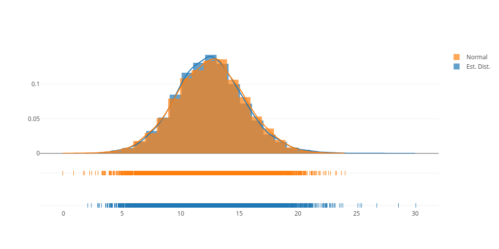

## Bayesian Neural Network test


```python
# import the libraries
import keras
from keras.models import Sequential
from keras.layers import Dense, Activation
from keras.layers.core import Lambda
from keras import backend as K
import plotly.plotly as plotly
import plotly.graph_objs as go
import plotly.figure_factory as ff
import numpy as np
from sklearn.datasets import load_boston
from sklearn.model_selection import train_test_split
from IPython.display import Image

# load the data set
boston = load_boston()
```


```python
# split the Boston Housing dataset
X_train, X_test, y_train, y_test = train_test_split(boston.data, boston.target, test_size=0.25, random_state=42)
```


```python
nodes = [64, 64, 64, 64, 1]

# build the model
model = Sequential()
model.add(Dense(nodes[0], input_shape=(13,)))
model.add(Activation('tanh')) 
model.add(Lambda(lambda x: K.dropout(x, level=0.2)))

model.add(Dense(nodes[1]))
model.add(Activation('tanh'))
model.add(Lambda(lambda x: K.dropout(x, level=0.2)))

model.add(Dense(nodes[2]))
model.add(Activation('tanh'))
model.add(Lambda(lambda x: K.dropout(x, level=0.2)))

model.add(Dense(nodes[3]))
model.add(Activation('tanh'))
model.add(Lambda(lambda x: K.dropout(x, level=0.2)))

model.add(Dense(nodes[4]))
model.add(Activation('linear'))

# callback
es = keras.callbacks.EarlyStopping(monitor='loss', min_delta=0, patience=100, verbose=1, mode='auto')
adam_optimizer = keras.optimizers.adam(lr=0.001, beta_1=0.80)
model.compile(loss='mean_squared_error', optimizer=adam_optimizer)
```


```python
# train the model
model.fit(x=X_train, y=y_train, verbose=0, batch_size=256, epochs=20000, callbacks=[es])
```

    Epoch 00902: early stopping


    <keras.callbacks.History at 0x120356940>


```python
# evaluate the model
model.evaluate(x=X_test, y=y_test)
```

     32/127 [======>.......................] - ETA: 0s


    24.931478094866897


```python
# define the index of the example
# ind = 113
ind = 45

# sample the estimates distribution
sample = np.empty(10000)
for i in range(10000):
    sample[i] = model.predict(X_test[ind].reshape(-1, 13))[0][0]

# check out the predictions
print("Prediction: {0:.2f}".format(np.mean(sample)))
print("Target: {}".format(y_test[ind]))
    
# compare to normal distribution
hist_data = [sample, np.random.randn(10000)*np.sqrt(np.var(sample)) + np.mean(sample)]
group_labels = ['Est. Dist.', 'Normal']

fig = ff.create_distplot(hist_data, group_labels)
plotly.image.save_as(fig, filename='E_dist.png', width=1000)
Image('E_dist.png')
```

    Prediction: 12.49
    Target: 15.1





