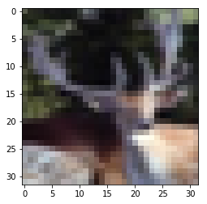

```python
# import statements
import keras
from keras.models import Sequential
from keras.layers import Dense, Conv2D, MaxPool2D, Flatten, Dropout, BatchNormalization
from keras.preprocessing.image import ImageDataGenerator
import keras.backend as K

from keras.datasets import cifar10
from keras.datasets import mnist

from quiver_engine import server
from matplotlib.pyplot import imshow

import tensorflow as tf
```

## Keras

### Data import


```python
# load the data
(x_train, y_train), (x_test, y_test) = cifar10.load_data()
# (x_train, y_train), (x_test, y_test) = mnist.load_data()
```


```python
# normalize the data
x_train, x_test = x_train/255., x_test/255.
```


```python
y_train = keras.utils.to_categorical(y_train, num_classes=10)
y_test = keras.utils.to_categorical(y_test, num_classes=10)
```


```python
# check an image
imshow(x_train[563])
```


    <matplotlib.image.AxesImage at 0x11e65c4a8>





### Model definition

**Data Augmentation**


```python
# datagen = ImageDataGenerator(
#     featurewise_center=True,
#     featurewise_std_normalization=True,
#     rotation_range=20,
#     width_shift_range=0.2,
#     height_shift_range=0.2,
#     horizontal_flip=True)

# # compute quantities required for featurewise normalization
# # (std, mean, and principal components if ZCA whitening is applied)
# datagen.fit(x_train)

# # fits the model on batches with real-time data augmentation:
# model.fit_generator(datagen.flow(x_train, y_train, batch_size=32),
#                     steps_per_epoch=len(x_train) / 32, epochs=20)
```

**Initializers**


```python
w_init = keras.initializers.glorot_normal()
b_init = keras.initializers.zeros()
w_dense_init = keras.initializers.random_normal()
```

**Optimizer and Callbacks**


```python
adam = keras.optimizers.Adam(lr=0.001, beta_1=0.9, beta_2=0.999, epsilon=1e-08, decay=0.0)
early_stopping = keras.callbacks.EarlyStopping(monitor="val_categorical_accuracy", mode="auto")
```

**Model**


```python
model = Sequential([
    Conv2D(filters=32, input_shape=(32, 32, 3), 
           kernel_size=(5,5), strides=(1,1), padding="same", use_bias=True,
           kernel_initializer=w_init, bias_initializer=b_init, activation="relu", name="Conv_1"),
    MaxPool2D(pool_size=(2,2), strides=(2,2), name="Pool_1", padding="same"),

    Conv2D(filters=64, kernel_size=(5,5), strides=(1,1), padding="same", use_bias=True,
           kernel_initializer=w_init, bias_initializer=b_init, activation="relu", name="Conv_2"), 
    MaxPool2D(pool_size=(2,2), strides=(2,2), name="Pool_2", padding="same"),
    
    Conv2D(filters=128, kernel_size=(5,5), strides=(1,1), padding="same", use_bias=True,
           kernel_initializer=w_init, bias_initializer=b_init, activation="relu", name="Conv_3"), 
    MaxPool2D(pool_size=(2,2), strides=(2,2), name="Pool_3", padding="same"),
    
    Flatten(),
    
    Dense(units=512, use_bias=True, kernel_initializer=w_dense_init, bias_initializer=b_init,
         activation="relu", name="Dense_2"),
    
    Dropout(rate=0.5),
    
    Dense(units=10, use_bias=True, kernel_initializer=w_dense_init, bias_initializer=b_init,
         activation="softmax", name="Dense_3")
])

model.compile(optimizer=adam, loss="categorical_crossentropy", metrics=["categorical_accuracy"])
```

**Training**


```python
model.fit(x=x_train, y=y_train, epochs=20, batch_size=32, validation_split=.15, callbacks=[early_stopping])
```

    Train on 42500 samples, validate on 7500 samples
    Epoch 1/20
    42500/42500 [==============================] - 260s 6ms/step - loss: 1.5560 - categorical_accuracy: 0.4322 - val_loss: 1.2698 - val_categorical_accuracy: 0.5501
    Epoch 2/20
    42500/42500 [==============================] - 227s 5ms/step - loss: 1.1818 - categorical_accuracy: 0.5799 - val_loss: 1.0559 - val_categorical_accuracy: 0.6276
    Epoch 3/20
    42500/42500 [==============================] - 233s 5ms/step - loss: 1.0140 - categorical_accuracy: 0.6403 - val_loss: 0.9725 - val_categorical_accuracy: 0.6640
    Epoch 4/20
    42500/42500 [==============================] - 227s 5ms/step - loss: 0.8959 - categorical_accuracy: 0.6863 - val_loss: 0.9237 - val_categorical_accuracy: 0.6764
    Epoch 5/20
    42500/42500 [==============================] - 223s 5ms/step - loss: 0.7929 - categorical_accuracy: 0.7207 - val_loss: 0.8977 - val_categorical_accuracy: 0.6904
    Epoch 6/20
    42500/42500 [==============================] - 219s 5ms/step - loss: 0.7099 - categorical_accuracy: 0.7507 - val_loss: 0.9333 - val_categorical_accuracy: 0.6825


    <keras.callbacks.History at 0x1200a84a8>


**Evaluation**


```python
model.evaluate(x=x_test, y=y_test)
```

    10000/10000 [==============================] - 16s 2ms/step


    [0.9640027988433838, 0.67959999999999998]


### Ghost Activations


```python
server.launch(model=model, input_folder="./img")
```
